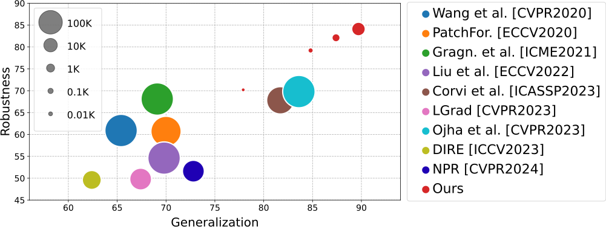

[](https://github.com/grip-unina/ClipBased-SyntheticImageDetection/)
[](https://arxiv.org/abs/2312.00195)
[](https://www.grip.unina.it)

The aim of this work is to explore the potential of pretrained vision-language models (VLMs) for universal detection of AI-generated images. We develop a lightweight detection strategy based on CLIP features and study its performance in a wide variety of challenging scenarios.
We find that, contrary to previous beliefs, it is neither necessary nor convenient to use a large domain-specific dataset for training.
On the contrary, by using only a handful of example images from a single generative model, a CLIP-based detector exhibits surprising generalization ability and high robustness across different architectures, including recent commercial tools such as Dalle-3, Midjourney v5, and Firefly.
We match the state-of-the-art (SoTA) on in-distribution data and significantly improve upon it in terms of generalization to out-of-distribution data (+6% AUC) and robustness to impaired/laundered data (+13%).

<center>
<br />
Area Under ROC Curve (AUC %) on unseen synthetic generators (x-axis) and on post-processed data (y-axis).
The first number measures the generalization ability of the detector, the second measures its robustness to possible impairments.
Circle area is proportional to training set size. Performance is measured over 18 different synthetic models.
Our CLIP-based detector largely outperforms all SoTA methods with very limited training data.
</center>


## Bibtex 

```
@misc{cozzolino2023raising,
  author={Davide Cozzolino and Giovanni Poggi and Riccardo Corvi and Matthias Nießner and Luisa Verdoliva},
  title={Raising the Bar of AI-generated Image Detection with CLIP}, 
  journal={arXiv preprint arXiv:2312.00195},
  year={2023},
}
```
  
## Acknowledgments
 
We gratefully acknowledge the support of this research by a TUM-IAS Hans Fischer Senior Fellowship, a TUM-IAS Rudolf Moßbauer Fellowship and a Google Gift. 
This material is also based on research sponsored by the Defense Advanced Research Projects Agency (DARPA) and the Air Force Research Laboratory (AFRL) under agreement number FA8750-20-2-1004.
The U.S. Government is authorized to reproduce and distribute reprints for Governmental purposes notwithstanding any copyright notation thereon.
The views and conclusions contained herein are those of the authors and should not be interpreted as necessarily representing the official policies or endorsements, either expressed or implied, of DARPA or the U.S. Government.
In addition, this work has received funding by the European Union under the Horizon Europe vera.ai project, Grant Agreement number 101070093.
It is also supported by the PREMIER project, funded by the Italian Ministry of Education, University, and Research within the PRIN 2017 program. 
Finally, we want to thank Koki Nagano for useful discussions, and Tero Karras, Yogesh Balaji, Ming-Yu Liu for sharing data for StyleGAN-T and eDiff-I experiments.
